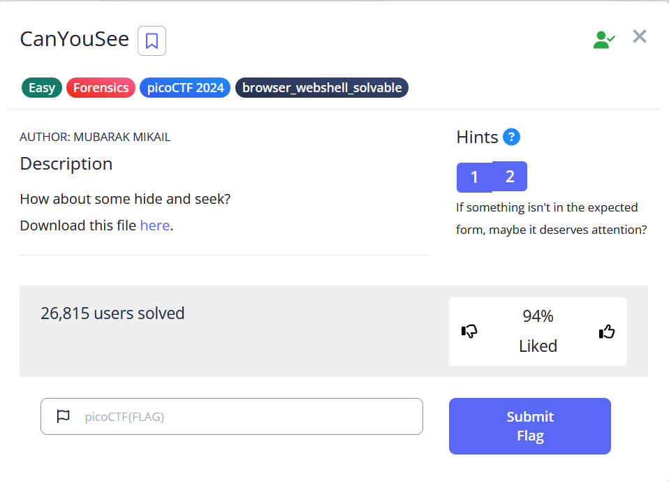
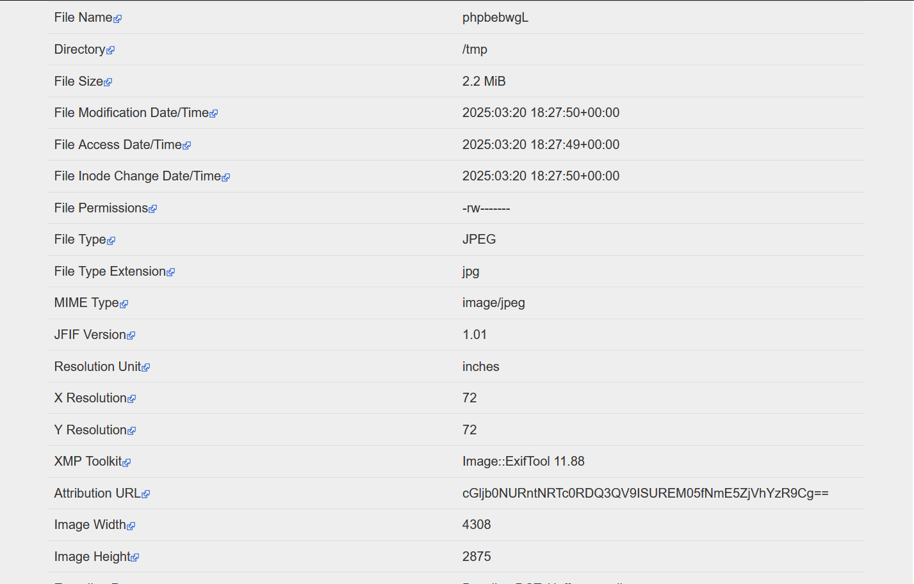
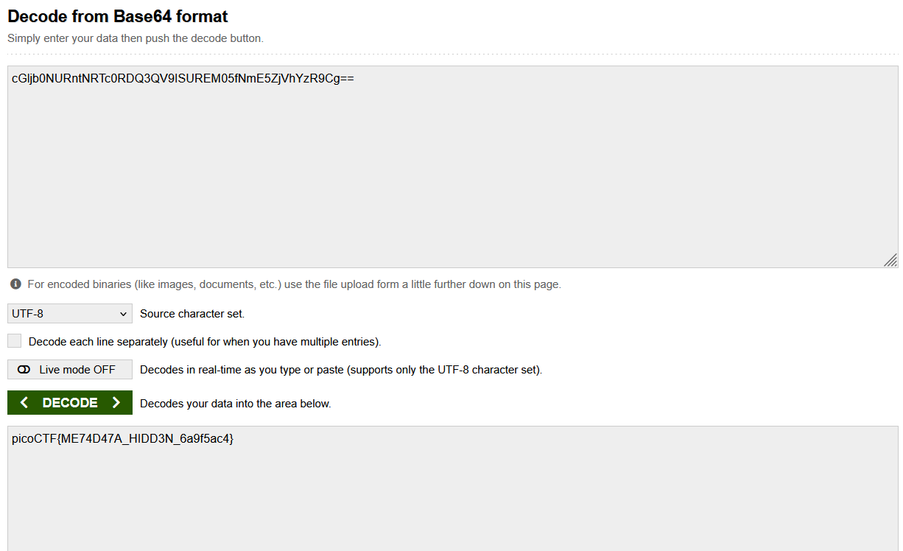

# CanYouSee
### Category: Forensics
   
### Step 1
We are given the following challenge.  
  
  
We are given a file as well: [file](ukn_reality.jpg)
  
The challenge clearly hints at some sort of data hidden within the challenge.   
I know there there a few likely ways that this is done. One is by inserting a file into another file, hiding something in the metadata, or hiding something in the hexcode. 

### Step 2
The first thing I decided to check is the file's metadata. You can use a cli tool like "exitfool" or you can use an online tool like I did. I used a website called "exif.tools" to view the data. Upload the file to this website and click "upload".  

### Step 3 

When you view the results, you can see a suspicious string under the attribution url.   
.  

### Step 4
We know this is a Base64 encoded string because of the two equal signs at the end of the string. We must base64 decode it now.   

After we decode the string we get the flag! The flag is: picoCTF{ME74D47A_HIDD3N_6a9f5ac4}