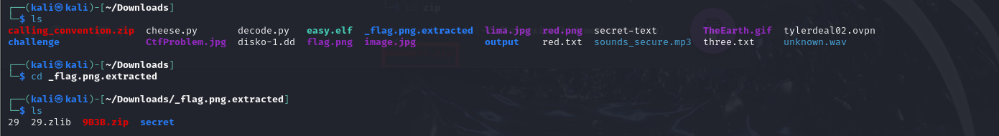
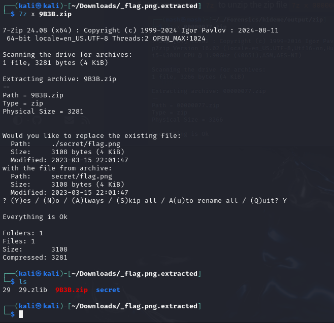
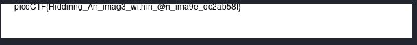

# hideme
### CATEGORY FORENSICS. 

Every file gets a flag. The SOC analyst saw one image been sent back and forth between two people. They decided to investigate and found out that there was more than what meets the eye here.      

1) We are given flag.png, it is just the picoctf logo. I know this is a forensics challenge, with the word hide in the title. So I will start by using binwalk to look for hidden files.      
2) I ran binwalk -e flag.png      
3) We extract some files. When I navigate to the folder, it looks like this.    
4)    
5) I then extract the hidden zip folder and it replaces flag.png.. 
6) Bingo, there is the flag. 

###  FLAG: picoCTF{Hiddinng_An_imag3_within_@n_ima9e_dc2ab585}