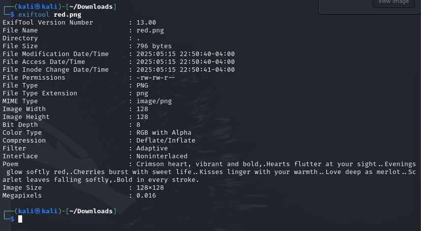
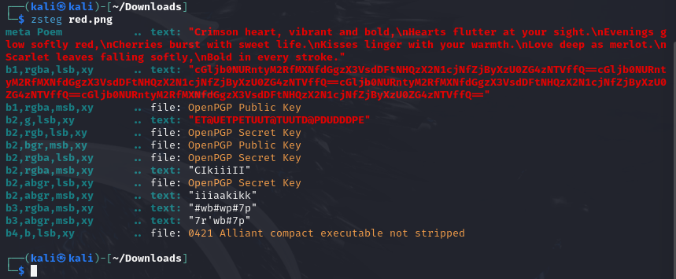
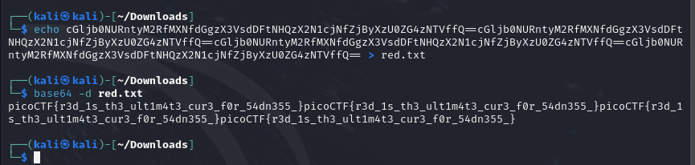

# RED
### CATEGORY FOENSICS

Description: RED, RED, RED, RED    
1) We are given a file called red.png. When we download and open it, it is just a red square.   
2) If we check the exifdata, we can see a poem.       
3) If we take the capitalized letters out, they spell CHECK LSB.      
4) LSB stands for least significant bit. I know this from previous CTF challenges, in particular JerseyCTF.      
5) I know I can use the tool zsteg for this problem.     
6) This gives us base64 encoded text that we can then decode.    
7)    
8) This gives us the flag! 

### FLAG: picoCTF{r3d_1s_th3_ult1m4t3_cur3_f0r_54dn355_}