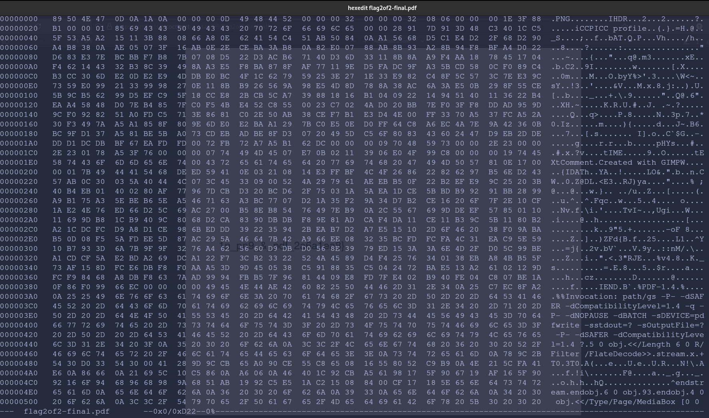
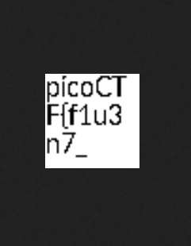

# Secret of the Polyglot
### Category: Forensics.

### Step 1) 
The challenge reads as follows: "The Network Operations Center (NOC) of your local institution picked up a suspicious file, they're getting conflicting information on what type of file it is. They've brought you in as an external expert to examine the file. Can you extract all the information from this strange file?"  
They then provide you with this [file](flag2of2-final.pdf).  
### Step 2)
If you open the PDF document, it will show you this image:   
This is clearly the second half of a flag based on the curly brackets and format.  
"1n_pn9_&_pdf_2a6a1ea8}"
### Step 3)
Let's see what is wrong with this file. I will use a hex editor to search the hex code and ensure that it has the correct file extension.  
I knew from previous CTF's that challenge files often have the wrong header. I was proven right when I saw this: .  
As you can see, the file has "PNG" and "GIMP" in the header. The former being the file format, and the latter being the program used to create said image.
### Step 4) 
Well, let's change the file extension to PNG and see what we get.  
Bingo. The first half of the flag:   
### Final Flag:
**picoCTF{f1u3n7_1n_pn9_&_pdf_2a6a1ea8}**

